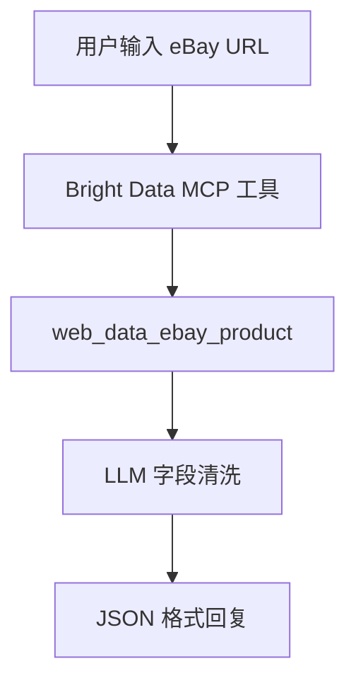

# eBay 数据抓取 Dify 工作流

这是一个可直接导入 Dify 的 eBay 商品详情采集工作流模板。工作流接收一个 eBay 商品详情页 URL，通过 Bright Data MCP 调用 `web_data_ebay_product` 工具获取商品原始数据，再由 LLM 节点清洗为统一 JSON 结构。

## 文件说明

| 文件 | 说明 |
| --- | --- |
| `eBay数据抓取.yml` | Dify 导出的工作流 DSL 文件，可直接导入 Dify |
| `README.md` | 当前配置与使用说明 |

## 工作流能力

- 输入一个 eBay 商品详情页 URL
- 调用 Bright Data MCP 的 eBay 商品数据工具
- 自动提取商品标题、价格、币种、运费、成色、品牌、卖家、库存等字段
- 输出合法 JSON，方便后续接入数据库、表格、报表或自动化流程

## 前置条件

使用前请先准备好：

1. Dify 工作区，可以是云端版或本地部署版。
2. Bright Data 账号，并已创建 MCP 服务。
3. Bright Data MCP 中已启用电子商务相关能力。
4. Dify 中已添加 Bright Data MCP 工具服务。
5. 可用的大模型供应商配置。本模板当前使用智谱 AI `glm-4.7`。
6. 一个真实可访问的 eBay 商品详情页 URL。

## 导入方式

1. 打开 Dify 控制台。
2. 进入「工作室」。
3. 点击「导入 DSL 文件」。
4. 选择本目录下的 `eBay数据抓取.yml`。
5. 导入后检查 MCP 工具和 LLM 模型配置。
6. 保存并运行预览。

## 工作流结构

当前工作流包含 4 个核心节点：

| 节点 | 名称 | 作用 |
| --- | --- | --- |
| Start | 用户输入 | 接收用户填写的 eBay 商品 URL |
| Tool | `web_data_ebay_product` | 通过 Bright Data MCP 获取 eBay 商品结构化原始数据 |
| LLM | `glm-4.7` | 将 MCP 返回数据清洗为统一 JSON 字段 |
| Answer | JSON格式回复 | 将 LLM 生成的 JSON 直接返回给用户 |

流程如下：



## 输入参数

| 参数 | 类型 | 必填 | 说明 |
| --- | --- | --- | --- |
| `url` | text-input | 是 | eBay 商品详情页 URL |

示例：

```text
https://www.ebay.com/itm/134042783029
```

## 输出字段

LLM 节点会把 MCP 原始数据整理为 JSON 数组，字段如下：

| 字段 | 说明 |
| --- | --- |
| `title` | 商品标题 |
| `price` | 商品价格，只保留数字，例如 `$19.99` 会输出为 `19.99` |
| `currency` | 币种 |
| `shipping` | 运费信息 |
| `condition` | 商品成色或状态 |
| `brand` | 品牌 |
| `seller_name` | 卖家名称 |
| `seller_rating` | 卖家评分 |
| `seller_reviews` | 卖家评价数量 |
| `availability` | 库存或可购买状态 |
| `item_id` | eBay 商品 ID |
| `item_url` | 商品链接，优先取返回数据中的 `url`，没有则取用户输入 URL |

缺失字段会返回空字符串。

## 输出示例

```json
[
  {
    "title": "Example eBay Product Title",
    "price": "19.99",
    "currency": "USD",
    "shipping": "Free shipping",
    "condition": "New",
    "brand": "Example Brand",
    "seller_name": "example_seller",
    "seller_rating": "99.8%",
    "seller_reviews": "12345",
    "availability": "In Stock",
    "item_id": "134042783029",
    "item_url": "https://www.ebay.com/itm/134042783029"
  }
]
```

实际返回内容以 Bright Data MCP 获取到的商品数据为准。

## 关键配置说明

### Bright Data MCP 工具

模板中使用的工具节点为：

```text
web_data_ebay_product
```

该工具要求传入有效的 eBay 商品 URL。导入模板后，如果工具节点显示不可用，请检查：

- Dify 中是否已经添加 Bright Data MCP 服务
- MCP 服务是否已授权
- Bright Data MCP 是否启用了电子商务工具
- 工具名称是否仍为 `web_data_ebay_product`

### LLM 模型

模板当前模型配置为：

```text
provider: langgenius/zhipuai/zhipuai
model: glm-4.7
```

如果你的 Dify 工作区没有配置智谱 AI，可以在 LLM 节点中切换为其他可用模型。建议选择稳定支持 JSON 输出的聊天模型。

### LLM 提示词规则

当前提示词约束如下：

- 只根据 MCP 原始数据提取字段
- 不猜测、不补充、不解释
- 输出必须是合法 JSON
- 不输出 Markdown
- 缺失字段返回空字符串
- `price` 只保留数字

如需扩展字段，可以直接修改 LLM 节点的 System Prompt 和字段列表。

## 常见问题

### 1. 导入后工具节点报错怎么办？

通常是 MCP 服务没有在当前 Dify 工作区重新授权。请先到 Dify「工具」中添加 Bright Data MCP 服务，再回到工作流里重新选择对应工具。

### 2. 为什么输出字段为空？

可能原因包括：

- eBay URL 无效或商品已下架
- Bright Data MCP 没有返回对应字段
- 当前商品页面本身缺少品牌、库存、运费等信息
- LLM 没有从原始数据中识别到字段

可以先查看工具节点的原始输出，确认 MCP 是否成功返回数据。

### 3. 可以批量抓取多个 URL 吗？

当前模板是单 URL 输入。如果要批量处理，可以在 Dify 中增加迭代节点、列表输入或外部自动化调度，把多个 URL 逐条传入 `web_data_ebay_product` 工具。

### 4. 可以改成输出 CSV 或表格吗？

可以。当前直接回复节点输出 JSON。如果需要 CSV，可以新增一个 LLM 节点或代码节点，把 JSON 转换为 CSV 格式；如果需要落库，可以继续接数据库、HTTP 请求或表格写入节点。

## 适合场景

- eBay 商品详情页字段采集
- 商品价格监控
- 竞品信息整理
- 卖家信息分析
- 商品数据入库前的结构化清洗
- Dify + MCP 数据采集工作流教学示例

## 注意事项

- 请确保采集行为符合目标网站条款、当地法律法规以及你的业务合规要求。
- Bright Data MCP 的实际可用字段可能随商品类型、地区、页面状态变化。
- 生产环境建议增加异常处理、重试策略、日志记录和结果校验。
- 如果用于批量任务，建议控制调用频率，并记录每个 URL 的执行状态。
